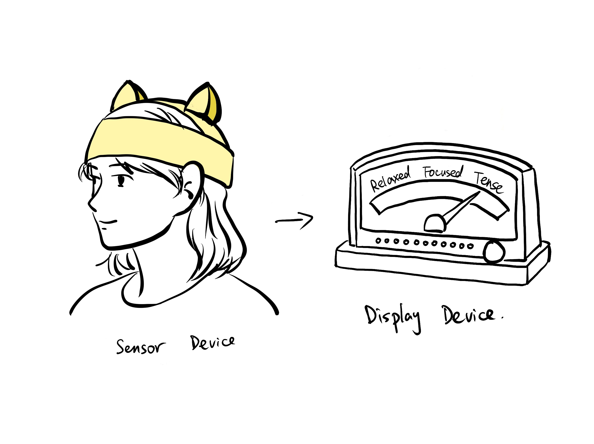
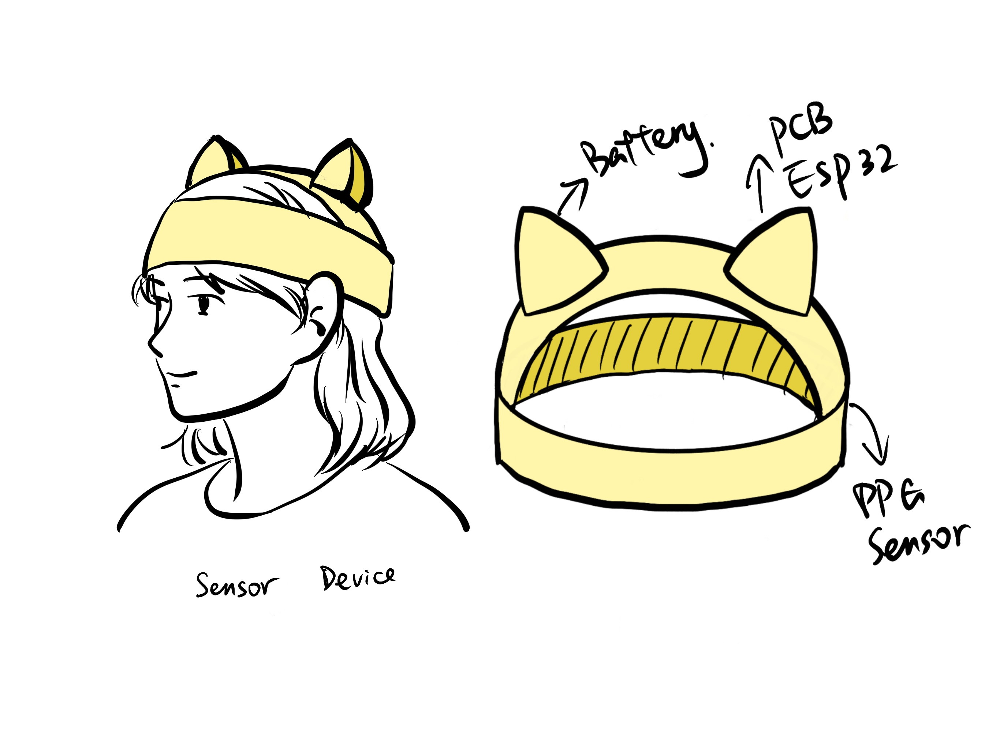
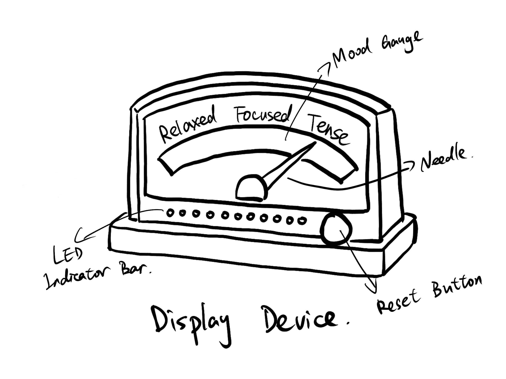
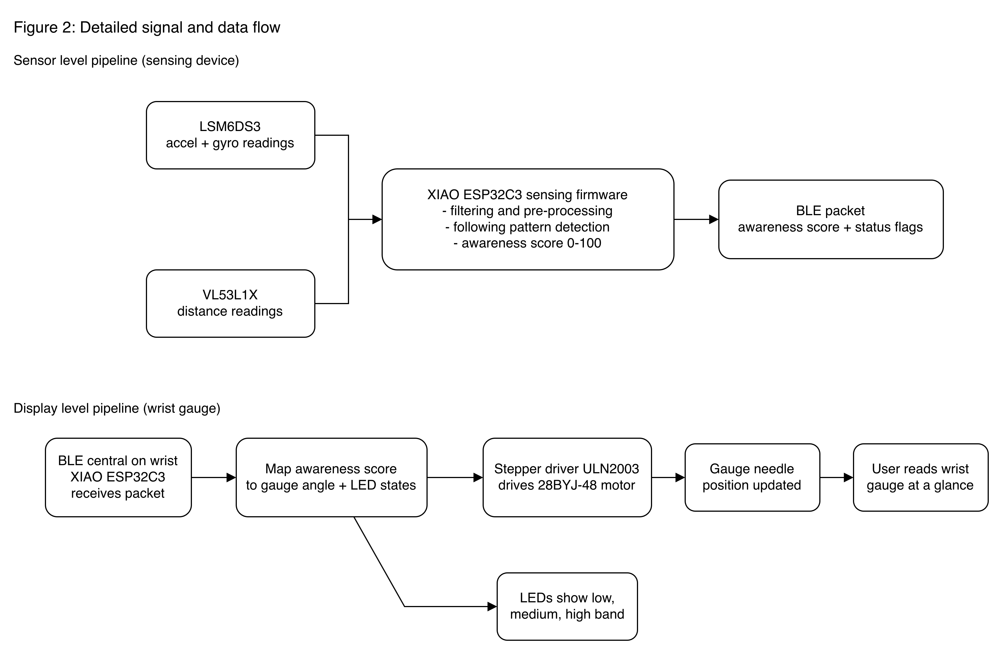

# Personal Safety Detector & Alarm

## 1. Project overview

### Title  
Personal Safety Detector & Alarm

### What it does  
The Personal Safety Detector & Alarm is a pattern-based proximity sensing for night and outdoor use. It is wearable two-device system that supports personal safety awareness by detecting potential following behavior based on distance change patterns rather than identity or location tracking. It is designed for situations such as walking alone at night or hiking on isolated trails, and mainly focuses on female using group. A wearable sensing module on the backpack monitors distance and motion patterns behind the user. A wrist-worn gauge translates these patterns into a calm, analog safety awareness display.

### General Sketch  

The system has two main physical pieces. The sensing device clips onto the top of a backpack strap or jacket collar facing backwards. It contains a rear-facing distance sensor, an IMU, a small processor board, battery and power switch inside a compact enclosure. The display device is worn on the wrist like a watch. It contains a small mechanical gauge needle driven by a stepper motor, several status LEDs and a single button for reset or acknowledge, all inside a wrist strap enclosure.

---

## 2. Sensing device

### Concept and placement  

The sensing device is a small module attached to the back side of the backpack strap or jacket collar, facing backward. It continuously measures how far objects are behind the user and how this distance changes over time. The device also includes a red LED and a buzzer to provide immediate local feedback when a high-risk pattern is detected.

### Electronics and part numbers  
Planned parts for the sensing device include:

- Processor and wireless  
  - Seeed XIAO ESP32C3 (ESP32-C3 based MCU with BLE)  
- Distance sensor  
  - ST VL53L1X Time-of-Flight distance sensor module  
- Motion sensor  
  - ST LSM6DS3 6-axis IMU (3-axis accelerometer and 3-axis gyroscope) 
- Alert and feedback components 
  - Active piezo buzzer, 3 V to 5 V
  - Red LED, 3 mm
  - Current-limiting resistor for LED (220 Ω to 330 Ω) 
- Power  
  - 3.7 V LiPo battery, about 500 mAh  
  - TP4056 LiPo charger module  
  - Power switch  
- Other  
  - Custom PCB for sensor and power connections  
  - Simple plastic enclosure that mounts on backpack or collar

### How it works  
The VL53L1X Time-of-Flight sensor continuously measures distance changes behind the user, while the LSM6DS3 IMU tracks the user’s motion state such as walking, stopping, or changing speed. The ESP32C3 processes both sensor streams and runs pattern detection to identify sustained distance correlation that may indicate potential following behavior.

When the computed awareness level exceeds a predefined threshold, the device activates a red LED and a buzzer to provide immediate local warning feedback. At the same time, awareness level data is transmitted via BLE to the wrist-worn display for calm, continuous visualization.

---

## 3. Display device

### Concept and placement  

The display device is worn on the user’s wrist, similar to a watch. It provides a quick, glanceable indication of current safety awareness level. The main interface is a mechanical gauge needle that moves smoothly between calm and high awareness. A row of small LEDs and a single button give simple additional interaction.

### Electronics and part numbers  
Planned parts for the display device include:

- Processor and wireless  
  - Seeed XIAO ESP32C3 (second board, acting as BLE central and display controller)  
- Gauge and indicators  
  - 28BYJ-48 stepper motor with ULN2003 driver board, used to move the gauge needle  
  - Four 3 mm LEDs for low, medium and high awareness indication  
  - One momentary tactile push button for reset or mode control  
- Power  
  - 3.7 V LiPo battery, about 500 mAh  
  - TP4056 LiPo charger module  
  - Power switch  
- Other  
  - Custom PCB for stepper driver, LEDs, button and power distribution  
  - Wrist strap enclosure that holds the gauge face and electronics

### How it works  
The wrist device receives awareness level messages over BLE from the sensing module. The XIAO ESP32C3 on the display side maps the awareness level to a needle position and drives the 28BYJ-48 stepper motor through the ULN2003 driver to move the gauge smoothly. LEDs turn on to show low, medium or high awareness bands, while the button lets the user acknowledge an event or temporarily reset the gauge. The device is designed to remain visually calm and avoid flashing or loud alerts.

---

## 4. System communication and diagrams

### 4.1 High level system diagram

- User wearing backpack and wrist gauge  
- Rear-facing sensing module on backpack strap  
- Wrist-worn gauge on arm  
- BLE wireless link between sensing module and wrist gauge  

### 4.2 Detailed data flow diagram (figure 2)
 

Sensor level pipeline  

VL53L1X distance readings  
+ LSM6DS3 accelerometer and gyroscope readings  
→ XIAO ESP32C3 sensing firmware  
  - filtering and pre-processing  
  - pattern detection for following behavior  
  - awareness score computation (for example 0 to 100)  
→ BLE packet with awareness score and status flags  

Display level pipeline  

BLE central on wrist XIAO ESP32C3 receives packet  
→ maps awareness score to gauge angle and LED states  
→ stepper motor driver (ULN2003) moves 28BYJ-48 motor  
→ gauge needle position updated  
→ LEDs show low, medium or high band  
→ user reads wrist gauge at a glance

---

## 5. Datasheets

All component datasheets used in this project are available in the `datasheets/` folder:

- [Seeed XIAO ESP32C3](datasheets/Seeed_XIAO_ESP32C3.pdf)
- [VL53L1X Time-of-Flight sensor](datasheets/VL53L1X_ToF_sensor.pdf)
- [LSM6DS3 IMU](datasheets/LSM6DS3_IMU.pdf)
- [28BYJ-48 Stepper Motor](datasheets/28BYJ48_stepper_motor.pdf)
- [ULN2003 Driver](datasheets/ULN2003_driver.pdf)
- [TP4056 Charger](datasheets/TP4056_charger.pdf)
- [Piezo Buzzer](datasheets/Piezo_buzzer.pdf)

